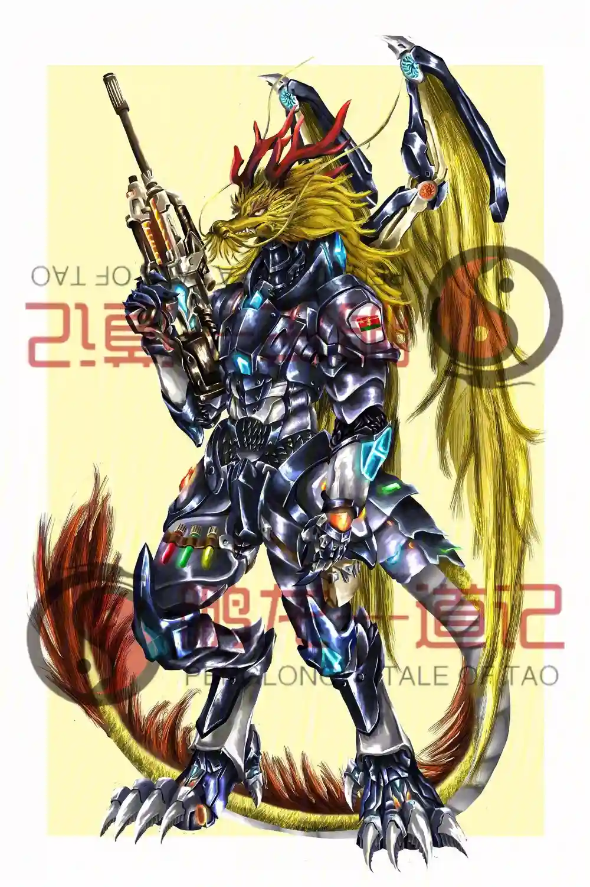
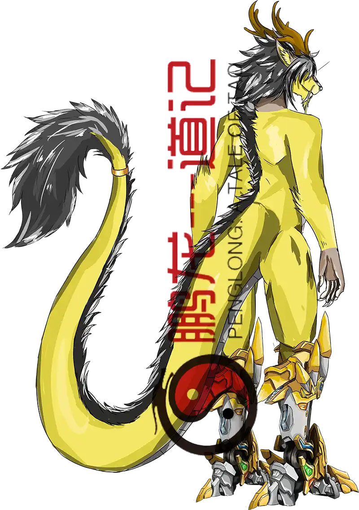

!!! warning "Situation Log Updated"

    警告：本页内容为架空物理法则的虚构内容，请勿较真

    警告：本页可能含有突然出现的一些 ~~战犯语录~~ （我还没输，我不是战犯！！！）

    警告：本页出现的相关设定图已经获取了 ==福建省版权局== 的认证，未经允许，请勿将其用于商业目的，否则后果自负。

## 设定简介

正如首页所说 `神麟` 是一只机械应龙，是 `道锋潜鳞 天渊应龙圣神大帝` 的一道身外化身。

完整设定上`神麟`的机械身躯由`三锻融合合金制作`（具体可参考小说，小说中的一种虚构金属合金），可抵御6倍以上的攻击。

`神麟`的单一构体（实体结构）由位于胸口和腹部的三块`神源晶`（具体可参考小说，小说中的一种虚构储能物质）提供能源。
每块`神源晶`能够提供的能量强度，相当于一位`天帝境`（具体可参考小说，小说中的等级划分，天帝后是荒帝然后是最高的宇宙法则）修士的丹田所能提供的能量大小。

#### 有机体，为时已晚！！

`神麟`具有无限重生的能力，这一能力的根源来自于神麟的结构。`天渊应龙圣神大帝`在创造神鳞的时候，使用的为云端计算、远程实体的模式。神麟的主体意识由分布在`北寒雷域`（小说中的宇宙名）1938个星系上的9018个数据中心中，每个数据中心由1945台128比特通用光量子计算机组成。庞大的计算网络为神麟的意识模拟和星系感知提供了计算条件。

`神麟`的计算网络允许神麟的意识同时接入五千个单一构体，构体间意识由计算网络同步。`神麟`的计算网络也允许`天渊应龙圣神大帝`通过自身神识链接至计算网络中，以提供星河级别的神识覆盖，以及宇宙级别的 ~~星河力量投射~~   &nbsp; ( ~~我坦白了，神麟是战犯~~ ，但是还没输，输了的才是战犯！！！！)

## 设定图鉴

说了那么多，来看看神麟的设定图吧

<figure markdown>
  { style="height:650px" loading=lazy}
  <figcaption>神麟设定图</figcaption>
</figure>

## 具体设定

### 神麟自述

{ style="height:300px" loading=lazy align=left}

> 太皇历15584435776年1月1日

东北寒雷域 壁垒阵四星系 β3星。

这个星系的主星是一颗A型恒星，它发出的耀眼的白色光芒每隔40小时就会照耀在β3星上。

按照39光年外Sol III上的土著的计算方法，它发出的光已经照耀了这颗星球30亿年了。

{ style="height:300px" loading=lazy align=right}

角龙一系，是这片大地上的主体物种，也在这片大地上生存了千万年之久，他们的领土已经延及周边数十个星系中。

我叫麟，是角龙之中的一员。和其他角龙不同的是，我的外表，似乎和远方的Sol III上的土著所谓的龙更有相似之处。

我的族人对此倒是并不在意，只是把我当做种族基因出现部分突变看待，认为丰富种族基因多样性也不是什么坏处。

> 太皇历15584436776年8月8日

角龙的身体颜色无非只有两种，蓝色和浅紫色，按照β3星上的科学家的研究，这或许和我们的主星产生的光谱有一定关系。我小的时候的颜色和他们也一般无二，无非就是颈部多了一片九彩的龙鳞罢了。

但是更多的区别在角龙进入少年阶段开始显现，九彩龙鳞附近的颜色开始渐渐从蓝色转为黄色，并且逐一向外扩展，直到我成年的那一天，我彻底变成了一头黄色的角龙。角龙的寿命很长，有6千年左右，按照Sol III上的土著的计算，大概就是一千岁左右。

与众不同的外观也导致我成了β3上的名龙，如果清一色冷色调中冒出个黄色点点，不用说，肯定是我了。以至于几乎整个角龙帝国的龙看见这样的的一抹黄色，都会问：麟，今天去哪呀。

不过，成年后一段时间，角龙帝国的一些高层次的官员倒是找过我，邀请我前往一处机密的圣地参观。也就是这样一段经历，给了我极大地震撼。

> 太皇历15584436788年9月18日

我被受邀前往β3星上最神秘的一处地方，被其他龙称为14区的一个地方。用于安乐天使的一些技术被修改后用在屏蔽这个地区上，一层层的电磁网让路过的领国科研船无法探查这个区域的样貌。

一位叫做秋的帝国官员向我介绍起这个地方存在的意义。

“北寒雷域在九千万年前，曾经有一位至高的主宰，这位主宰的能力，已经到了能够直接操作北寒雷域整个宇宙的基本法则的水平了。他在的时候，北寒雷域所有的星系都在他的帝国版图之下。”

“那这位主宰，他是死了吗？”，我不解的问，因为据我所知，现在北寒雷域分为东南西北四大区域，由一百多位各个种族的首脑共同执掌。

秋做了个哑声的动作，指了指天上

“不，他无处不在”

“无处不在？”，我显然是不能理解这一切，我曾经听闻邻国的灵能飞升有人能够用神识去探查覆盖整个星系的范围的事物，但不过只能坚持几分钟而已。这位曾经的主宰有何种威能竟能监视整个宇宙。

秋显然是看出了我的疑惑，“按照留下来的文献来看，主宰的神识也只能覆盖到半个北寒雷域。但现在不一样，他不是死去了，而是燃烧了半身能量，冲破了我们这个维度，强行将自己打到更高的维度去了。我们是三维半的世界，长宽高，还有一个时间之箭。但是主宰可能在四维，可以随便控制时间的维度，甚至在五维，六维，还可能是十一维。通过吸收的半个宇宙的能量，强行将自己的灵魂打入更高维度。就像我们观察二维平面一样，主宰能够轻易的控制我们这个三维世界”

“等等，那不是就是我们在研究的以太相引擎吗？”

“不完全一样，虽然是是一样的升维，但以太相只是把主体种族的灵魂升入高维，最多只能到四维或者五维，而这需要牺牲整个宇宙为代价，且提升的本身占据宇宙能量的比例不一样。但主宰不一样，因为主宰算得上是宇宙法则的化身，相当于用一半宇宙的能量去让另外一半的实体升维。代价更高。不过，这些不是关键的问题。”

“关键的问题？”，我有点迷惑。

“是的，难道你不想知道为什么你一个普普通通的帝国公民能来到这吗？”，秋反问我，顺手点开了大厅墙上的全息投影。

“是啊，我为什么呢....等等，这是？”，我看着全息投影上的那位一个恒星高，通体金黄，全身覆盖着九彩鳞片的龙，呆住了。

{ style="height:400px" loading=lazy align=left}

“是它？”尽管全息投影上仅仅只向我彰显了北寒主宰的背面，但我立马就反应过来了。

“你认识？”，秋有点难以置信的看着我，主宰的存在可是我们帝国一级机密的东西。

“准确的说，不认识，但是它。。曾经出现过我的梦里”，我如实回答。

秋若有所思的点了点头，和一边的另外几位专家低声交流了一会，“果然啊，。。。”

> 未完待续......
