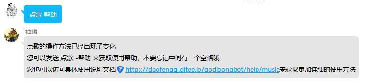

## 指令一览

本功能核心命令前缀 `点歌 `

指令和各个餐宿之间以空格分离，部分指令严格遵从空格分离机制

举几个正确的例子：

1. 点歌 帮助
2. 点歌 -网易 Creation and Beyond
3. 点歌 -酷狗 Creation and Beyond

下面是目前已经开放的所有参数

使用时请使用 `点歌 + 指令（+可选参数）` 的方式来调用神麟

|指令|效果|是否有子参数|子参数内容|说明|
|---|-------------|----|----|-----------------------|
| [帮助](#help) |发送帮助页面，详细信息请见帮助|否| |无|
| [-网易](#netease) |发送搜歌列表，进一步选择需要点的歌|是|歌曲名|使用网易云音乐为数据源进行搜索歌曲|
| [-netease](#netease) |发送搜歌列表，进一步选择需要点的歌|是|歌曲名|使用网易云音乐为数据源进行搜索歌曲|
| [-酷狗](#kugou) |发送搜歌列表，进一步选择需要点的歌|是|歌曲名|使用酷狗音乐为数据源进行搜索歌曲|
| [-kugou](#kugou) |发送搜歌列表，进一步选择需要点的歌|是|歌曲名|使用酷狗音乐为数据源进行搜索歌曲|

## 数据源

{ style="height:280px" loading=lazy }
{ style="height:280px" loading=lazy }

## 功能展示

### 帮助 { #help }

指令 ： `点歌 帮助`

{ style="height:280px" loading=lazy }

### 网易点歌 { #netease }

指令 ： `点歌 -网易 歌曲名` 或 `点歌 -netease 歌曲名`

=== ":octicons-check-circle-fill-16: 成功点歌"

    如图，发回一张最长为10的歌曲列表，您需要回复序号进行点歌
    [![content.tabs.link success_getsong]][content.tabs.link success_getsong]

=== ":octicons-skip-16: VIP歌曲点歌失败"
    
    如图，由于网易修改了相关接口，目前无法解析非大陆地区发售的歌曲或VIP歌曲，会返回如下
    [![content.tabs.link faild_vip]][content.tabs.link faild_vip]

  [content.tabs.link success_getsong]: ../assets/images/music/success_netease.jpg
  [content.tabs.link faild_vip]: ../assets/images/music/vip_netease.jpg

### 酷狗点歌 { #netease }

指令 ： `点歌 -酷狗 歌曲名` 或 `点歌 -kugou 歌曲名`

=== ":octicons-check-circle-fill-16: 成功点歌"

    如图，发回一张最长为10的歌曲列表，您需要回复序号进行点歌
    [![content.tabs.link success_getsong_kugou]][content.tabs.link success_getsong_kugou]

=== ":octicons-skip-16: VIP歌曲点歌失败"
    
    如图，由于酷狗修改了相关接口，目前无法解析非大陆地区发售的歌曲或VIP歌曲，会返回如下
    [![content.tabs.link faild_vip_kugou]][content.tabs.link faild_vip_kugou]

  [content.tabs.link success_getsong_kugou]: ../assets/images/music/success_kugou.jpg
  [content.tabs.link faild_vip_kugou]: ../assets/images/music/vip_kugou.jpg

